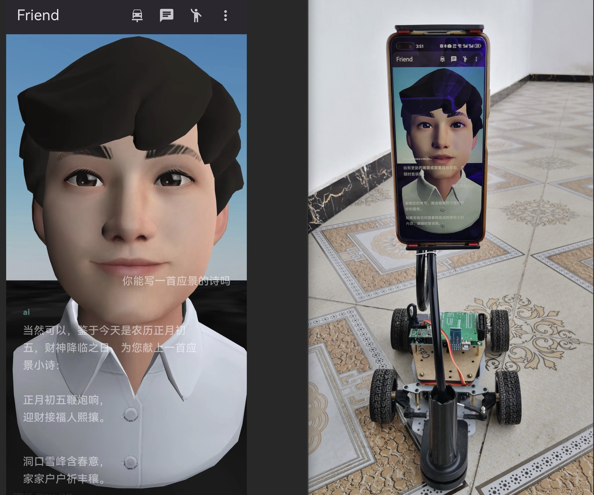

# iSee
## Incroduction
* Video Demo
	* http
* Image preview

## Usage 

### 1 Install your own server

Refer to:
https://github.com/see2023/iSee-server

### 2 Install App

* Compile
`
cp ./lib/data/constants.dart.example ./lib/data/constants.dart
`

## Thanks
As a back-end developer in a traditional industry, this is my first attempt at developing a mobile app, which also involves a lot of AI and 3D related knowledge. 
Thanks for the support of New Bing and various projects and organizations below:
- Flutter related
	- get
	- flutter_chat_ui
	- isar & hive
	- many more in [dependencies](./pubspec.yaml)
- AI related
	- openai
	- azure tts
	- google ml kit
	- https://www.xfyun.cn/
	- https://tongyi.aliyun.com/qianwen/
- Avatar related
	- https://github.com/BabylonJS/Babylon.js
	- https://readyplayer.me/
	- https://www.mixamo.com/
	- https://www.blender.org/
	- https://github.com/fishaudio/Bert-VITS2
	- https://github.com/see2023/Bert-VITS2-ext
- Rtc related
	- https://livekit.io/

## LICENSE
Copy from the components used [license](./LICENSE)
